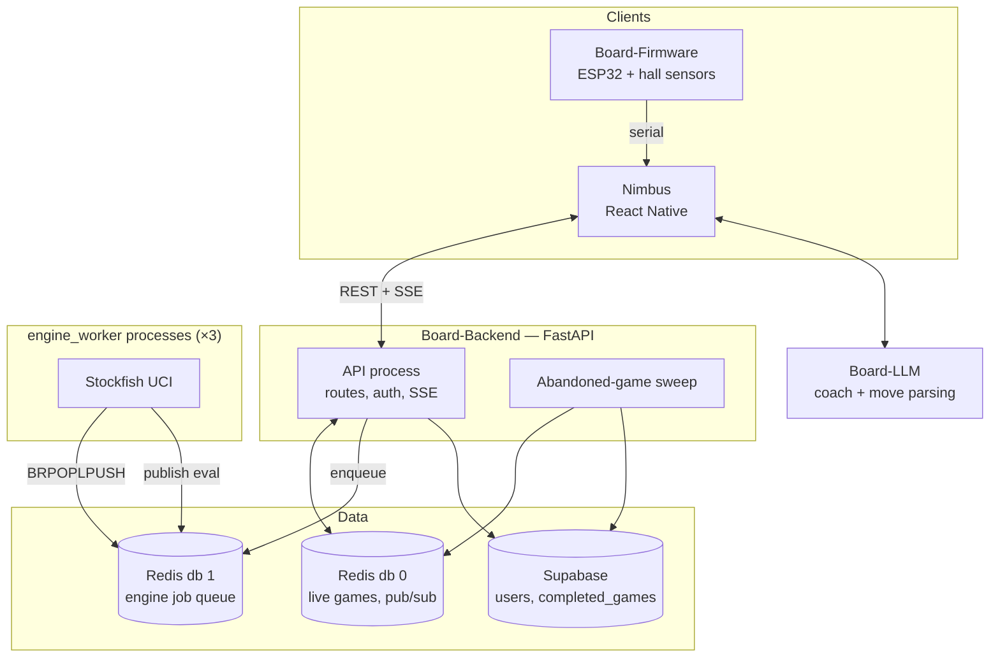

# Board-App

**A smart chess board: a physical ESP32 sensor board, a React Native app, and a Python
backend that runs live multiplayer, server-side Stockfish analysis, and a voice-driven
coach.**


Move a piece on the physical board and it moves in the app. Say "knight to f3" and it
plays. Share an eight-character code and a friend joins your game — or an audience
watches it live. A pool of Stockfish workers scores every position as you play.

---

## Contents

- [What it does](#what-it-does)
- [Architecture](#architecture)
- [Engineering highlights](#engineering-highlights)
- [Measured results](#measured-results)
- [Tech stack](#tech-stack)
- [Repository layout](#repository-layout)
- [Running it](#running-it)

---

## What it does

| Feature | Detail |
|---|---|
| **Play a friend** | Create a lobby, share an invite code, play live. State lives in Redis; finished games archive to Supabase. |
| **Spectate** | Anyone with the invite code watches live — read-only board, eval bar, move list, watcher count. |
| **Server-side Stockfish** | Live eval at depth 12 while you play; depth-20 review of archived games. |
| **Voice control** | "Knight to f3", "castle kingside", "queen takes d5" — parsed, validated, played. |
| **AI coach** | Position analysis, opening and endgame advice through an LLM service. |
| **Lichess** | OAuth linking and online play against the Lichess pool. |
| **Physical board** | ESP32 + hall-effect sensors + 16-channel multiplexer detect piece positions. |
| **Local play** | Pass-and-play, bot games, puzzles, and reviewable local history. |

---

## Architecture



The API never runs Stockfish itself. It enqueues a job on Redis and streams the result
back over SSE, so a depth-20 analysis can't block a move request.

---

## Engineering highlights

### Live games are Redis-native, so the API scales sideways

A friend game's authoritative state is a JSON blob in Redis under `game:{id}` with a 48h
TTL. Every move takes a short per-game lock, validates against `python-chess`, writes the
new state, and `PUBLISH`es it. Clients hold an SSE stream subscribed to that channel.

Because coordination lives in Redis rather than in process memory, adding API processes
adds throughput: at 400 concurrent games, one process delivered 361 moves/s at p95
1,435 ms, while four processes delivered **637 moves/s at p95 11 ms**.

| Redis key | Purpose |
|---|---|
| `game:{id}` | Live state (FEN, moves, players, status), 48h TTL refreshed on write |
| `invite:{code}` | Invite code → `game_id` |
| `lock:game:{id}` | Short-lived lock for join / move / resign |
| `game:shadow:{id}` | Snapshot outliving the live key, for the abandoned-game sweep |
| `game:spectators:{id}` | Set of viewers admitted by invite code |
| `game:events:{id}` | Pub/sub channel feeding every SSE subscriber |

### Spectating reuses the player path instead of duplicating it

Watchers subscribe to the same `game:events:{id}` channel as players, so there is no
second delivery path to keep correct. What is new is admission: `POST /games/watch`
takes the invite code players already use, hands players back their own seat, and adds
anyone else to a Redis set. Reading state or opening the stream requires membership in
that set, so a stranger cannot watch by guessing a game ID.

```
POST /games/watch  { "invite_code": "V22KB5K0" }
  -> { "state": {...}, "role": "spectator", "spectator_count": 1 }
```

An end-to-end check ([`scripts/verify_spectate_eval.py`](Board-Backend/scripts/verify_spectate_eval.py))
drives two players, one spectator and a stranger against a live stack — 20 assertions
covering admission, refusal, per-move delivery and engine eval.

### An SSE race that only shows up under load

The stream handler originally read the game state, then subscribed to the channel. A move
published in the gap between those two steps was lost: not in the snapshot, and not yet
subscribed for. The fix is to subscribe first and re-read afterwards, so the snapshot can
only be newer than the subscription:

```python
pubsub.subscribe(channel)
# Re-read after subscribing so a move published between the permission check
# and SUBSCRIBE isn't missed.
snapshot = await get_friend_game(redis, game_id, uid, allow_spectator=True)
yield f"data: {snapshot.model_dump_json()}\n\n"
```

### The engine queue does not lose jobs

Workers claim jobs with `BRPOPLPUSH` onto a processing list, so a job is never in flight
without being recorded somewhere. A reclaimer returns jobs whose worker died past a
visibility timeout, and repeated failures dead-letter rather than loop. Killing workers
mid-run with **12 SIGKILLs across 300 jobs lost none** — 11 were recovered by the
reclaimer and 0 were dead-lettered.

Identical positions requested by both players deduplicate onto one job. Making that claim
atomic took the dedupe hit rate from 4% to **50%** at 10 games and cut time-to-first-eval
p95 from 88 ms to 45 ms.

### Blocking calls kept off the event loop

Archiving a finished game calls the Supabase Python client, which is synchronous — and it
runs while the per-game lock is held. Left on the event loop it stalls every other game on
that process. It now runs via `asyncio.to_thread`, so the lock is released promptly and
unrelated games are unaffected.

### Consolidating the design language

The app's dark olive theme was re-typed as hex literals in every screen, which produced
`#fff` beside `#ffffff`, three different reds and a dozen greys separated by a few points
of luminance that nobody had chosen deliberately.

[`nimbus/src/theme.ts`](nimbus/src/theme.ts) now defines semantic colour, spacing, radius
and type tokens, each documented with the role it plays. **Colour is fully migrated** —
roughly 350 literals across 19 screens and 8 components, collapsed onto named tokens; the
only hard-coded colour left is Google's brand blue on the Sign-In button, which has to
stay that exact value and is commented as such.

Spacing and radius are **partly** migrated — 298 of 452 literals — done strictly
value-preserving: only exact token matches were rewritten, nothing rounded, and a checker
resolved every token back to its number to prove the source was byte-identical afterwards.
The layout did not move.

The 154 leftovers turned out to be the interesting part. They cluster on `10`, `14` and
`18`, which means **the app is built on a 2pt rhythm, not the 4pt scale the tokens
assume**. Finishing the job means first deciding which is correct — extend the scale, or
snap the app onto 4pt and accept a visible shift. Typography is untouched for the same
reason: collapsing 14 sizes onto 7 changes every screen. Tracked in
[docs/design-system.md](docs/design-system.md).

---

## Measured results

Full methodology, raw output and reproduction scripts:
**[Board-Backend/BENCHMARKS.md](Board-Backend/BENCHMARKS.md)**.

Measured on a Mac mini (Apple M4, 10 cores, 16 GB). Supabase and JWT lookup are stubbed
so the numbers describe the Redis path; everything else is production code.

| Claim | Result |
|---|---|
| Moves reach the opponent quickly | **p95 43 ms** at 50 concurrent games, **54 ms** at 200 |
| The API scales horizontally | 400 games: 1 process **361 moves/s / p95 1,435 ms**; 4 processes **637 moves/s / p95 11 ms** |
| Simultaneous moves can't corrupt a game | 100 rounds × 20 identical concurrent moves: **exactly 1 accepted each round**, 0 bad states |
| Engine queue scales with workers | 64 depth-16 jobs: **2.93× with 3 workers, 5.2× with 8** |
| Live eval is fast | 3 workers sustain **60 eval req/s**, time-to-first-eval **p95 31 ms** |
| Dedupe shares work between players | Hit rate **4% → 50%**; first-eval p95 **88 → 45 ms** |
| No lost jobs when workers die | **12 SIGKILLs** during 300 jobs: **0 lost**, 11 reclaimed |
| Stable under sustained load | 10-min soak, 60 games: **24,125 moves, 48,250 evals, 0 missed**; RSS 75 → 85 MB |

Backend test suite: **31 passing, 1 skipped**.

---

## Tech stack

| Layer | Technology |
|---|---|
| Mobile | React Native (CLI), TypeScript |
| Backend | Python 3.12, FastAPI, Redis, Supabase (Postgres) |
| Engine | Stockfish via UCI in dedicated worker processes |
| Chess rules | `python-chess` server-side validation |
| Realtime | Redis pub/sub + Server-Sent Events |
| LLM | FastAPI service over Hugging Face models |
| Firmware | C++, PlatformIO, ESP32, hall-effect sensors |
| Auth | JWT, Google OAuth, Lichess OAuth2 |

---

## Repository layout

| Path | Purpose |
|---|---|
| [`nimbus/`](nimbus/) | React Native app — screens, services, hooks, design tokens |
| [`Board-Backend/`](Board-Backend/) | FastAPI API, friend-game service, engine queue, workers |
| [`Board-Backend/engine_worker/`](Board-Backend/engine_worker/) | Separate process: claims jobs, drives Stockfish |
| [`Board-LLM/`](Board-LLM/) | Coach and move-parsing service |
| [`Board-Firmware/`](Board-Firmware/) | ESP32 firmware (PlatformIO) |
| [`docs/`](docs/) | [Setup](docs/SETUP.md) · [API reference](docs/api-routes.md) · [Architecture](docs/complex-logic.md) · [Schema](docs/database-schema.md) · [Design system](docs/design-system.md) |
| [`Board-Backend/BENCHMARKS.md`](Board-Backend/BENCHMARKS.md) | Performance methodology and results |
| [`scripts/`](scripts/) | Dev helpers and the Docker stack driver |

---

## Running it

```bash
cd Board-Backend
./scripts/dev-stack.sh up 3      # Redis + API + 3 Stockfish workers
```

Full instructions — environment variables, Supabase, mobile builds, tests and
benchmarks — are in **[docs/SETUP.md](docs/SETUP.md)**.

---

## License

Proprietary. All rights reserved.
